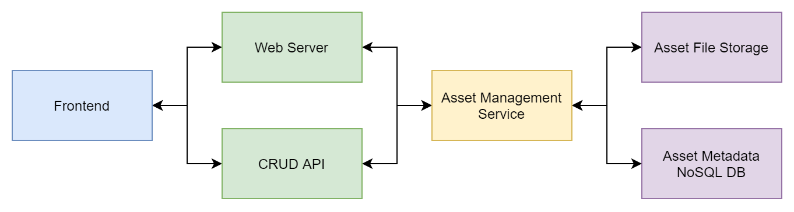

# Cloud Asset Catalog

A solution for storing 3D models of products along with their metadata that can be managed from a web frontend or other client using the CRUD API.

3D models will be stored in [glTF](https://en.wikipedia.org/wiki/GlTF) format

## High Level Overview

## Frontend

React app that allows CRUD operations to the server. First priority (P1) is CRUD operations; user auth will come later.

Capabilities:
- Upload new asset
  - Form for metadata and asset file
- List assets
  - Search by fields
  - Filters (upload time, name, SKU, uploader)
- Update existing asset metadata or model
- Delete existing asset
- View specific asset metadata and show the 3D model interactively

## Backend

### Web Server

Express server that handles serving the built React app on appropriate routes.

### CRUD API

- Query assets by metadata fields
- Read metadata and download 3D model
- Update existing asset metadata or model
- Delete existing asset

### Asset Management Service

Facilitates the interactions between the API and Asset File Storage and Asset Metadata DB.

## Storage

### Asset File Storage

Some kind of file system that we can upload and download 3D model files to and from. We'll need to store a path or an ID that lets us grab a file quickly.

### Asset Metadata DB

Probably a NoSQL DB (MongoDB) that will store JSON objects we can query and display on the frontend.